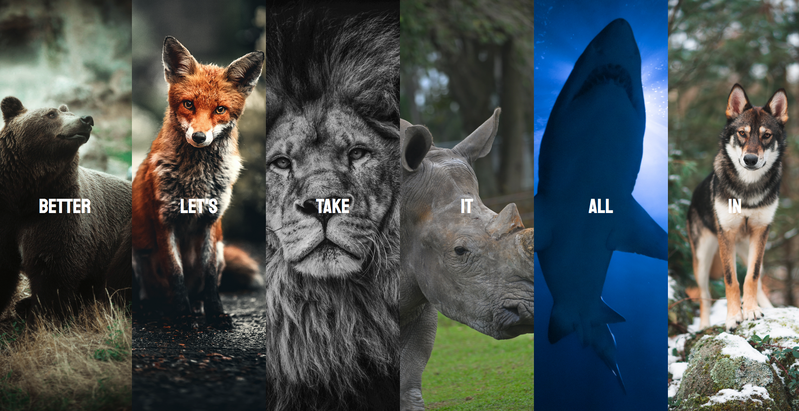
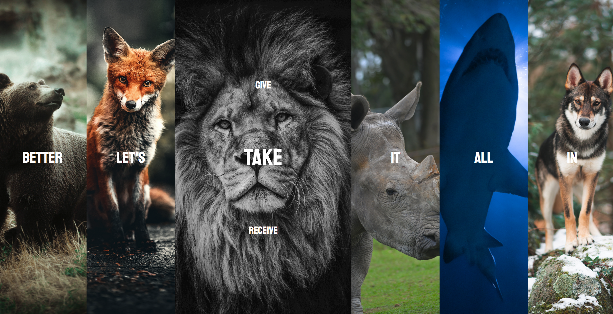

# Flexbox and simple transitions

With this simple project I wanted to solidify my knowledge about CSS Flexbox and transitions. Also, I used vanilla JS to change the background property of the different boxes.

This small project really emphasized how to use flexbox, and how to nest different flexbox layouts. Properties like `align-items` or `justify-content` really come in handy when building simple, but also complicated layouts with this model.

When hovering the tiles, the selected tile zooms in by changing the `flex-grow` property. Also, I use `cubic-bezier` to animate the transition of the text.

